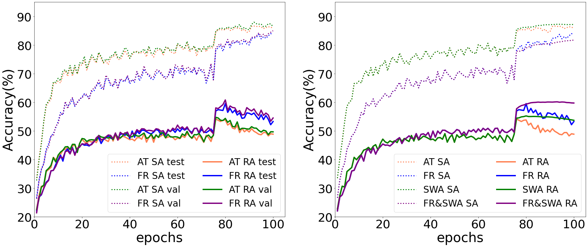

# FR: Frequency Regularization

Code for paper "Frequency Regularization for Improving Adversarial Robustness" accepted by Practical-DL Workshop @AAAI 2023. [[PDF]"./pdf/AAAI2023_Workshop.pdf"]

# Introduction

We investigate the behavior of adversarial training from a spectral perspective.
1. This work reveals that an adversarially trained model focuses primarily on low-frequency content for predictions, which accounts for the low standard accuracy due to underutilization of high-frequency information.
2. We argue for the first time that the white-box attack can adapt its aggressive frequency distribution to the target model’s frequency bias, thereby explaining why white-box attacks are so hard to defend.
3. We utilize weight averaging in AT as a method of smoothing kernels in the training time-axis dimension to mitigate the robust overfitting problems.
4. A frequency-based regularization is proposed to significantly improve the robust accuracy.

## Environment
RTX 3090, pytorch: 1.7.1

## Train

```bash

# Standard adversarial training
# dataset_path: Path for the dataset.
# trial: Experiment index
python main.py --model resnet --dataset cifar10 --dataset_path XXXXX --trial X

# AT + FR
python main.py --model resnet --dataset cifar10 --dataset_path XXXXX --trial X --fre_loss

# AT + FR/WA
python main.py --model resnet --dataset cifar10 --dataset_path XXXXX --trial X --fre_loss --swa

```

## Evaluation
```bash
# ckpt_path: Path for the saved checkpoint.
python Robustness.py --ckpt_path XXXXXXXXX
```

# Results

Top-1 robust accuracy(\%) of the WideResNet-34-10 model on the CIFAR-10.

| Method                    |  Clean        | FGSM          | PGD-20           | CW              | AA              |
| ------------------------- |:------------: |:------------: |:----------------:|:---------------:|:---------------:|
| PGD-AT                    | 84.62         | 60.17         | 55.01            | 53.32           | 51.42           |
| TRADES                    | 84.65         | 61.32         | 56.33            | 54.20           | 53.08           |
| MART                      | 84.17         | 61.61         | 58.56            | 54.58           | 51.10           |
| AWP                       | 85.57         |**62.90**        | 58.14            | 55.96           | 54.04           |
| AT-SWA                    | **86.17**         | 61.20         | 55.18            | 54.57           | 52.25           |
| AT-FR(ours)               | 80.59         | 61.47         | 59.49            | 54.33           | 52.06           |
| AT-FR-SWA(ours)           | 81.09         | 62.49         | **60.12**          | **56.14**         | **54.35**          |


<div align="center">

</div>

